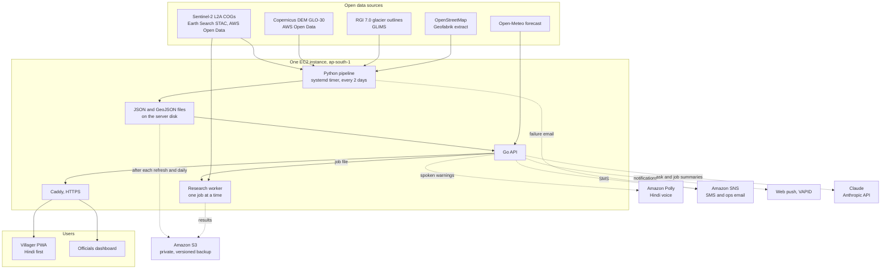

# Aahat (आहट)

A satellite watch on Himalayan glacial lakes and the valleys below them, starting with Himachal Pradesh.
Built for [Environmental Hacks](https://www.wemakedevs.org/aws/env) (WeMakeDevs x AWS), Heat and Water track.

When a glacial lake bursts (a glacial lake outburst flood, GLOF), the water goes down a valley where people
live beside the river. Aahat
measures 22 such lakes in and upstream of Himachal Pradesh from Sentinel-2 imagery, ranks them with a score
whose every factor is shown with its source, estimates where a flood from each would go and how soon it would
reach each village, and gives a villager a plain answer in Hindi: is my village in a flood path, from which
lake, how many minutes, and what to do. District officials get the same data on a dashboard, with the
evidence behind each number and an alert tool that warns the nearest villages first.

| | Live link |
|---|---|
| Villager app (Hindi first, installable) | <https://15-206-138-242.sslip.io/> |
| Officials' dashboard | <https://15-206-138-242.sslip.io/officials/> |
| API | <https://15-206-138-242.sslip.io/api/lakes> (all routes in [API.md](API.md)) |

Every flood figure in Aahat is a screening estimate from a 30 m elevation model, not a hydraulic model.
Aahat does not detect a burst as it happens and does not predict when a lake will burst.
The full list is under [Limits](#limits).

## What it does

- **Measures each lake every season.** Lake outlines and areas for 2017 to 2026 come from Sentinel-2 L2A
  scenes read in place from AWS Open Data. Each yearly record names the scenes it was mapped from.
- **Scores each lake, and shows why.** score = 100 × size × likelihood, from five measured factors, each with
  its value, rule and published source. Today the two highest are Samudra Tapu (62.0) and Gepang Gath (61.6),
  both "very high"; 5 lakes are "moderate" and 15 "low" (live API, 10 Oct 2026).
- **Estimates the flood below each lake.** A flow path up to 150 km long over the Copernicus DEM, an expected
  and a severe scenario, the flood depth every 250 m, a flood corridor, and an arrival time at every
  settlement, bridge, road, hydro project, school and clinic that OpenStreetMap maps near the path.
- **Warns the nearest villages first.** An alert goes to subscribers in arrival order, each with their own
  minutes to arrival, as a Hindi voice message (Amazon Polly), a text message (Amazon SNS) and a browser
  notification (web push). Officials can run it as a dry run that plans and voices the alert and sends nothing.
- **Watches heat and rain.** For each lake the API reads a three-day forecast from Open-Meteo and raises a
  weather level when heavy rain is forecast, or when the forecast maximum temperature is 5 C or more above the
  mean of the past three days (fast melt). Heat and rain are the two inputs this trigger watches, which is
  where the project meets the Heat and Water track.
- **Looks for a lake that has emptied, and for a newly blocked river.** At each refresh the newest clear
  scene is compared with the season outline (a drop of more than 30% raises a dry-run alert for officials),
  and the first 60 km of river below each lake is scanned for new standing water.
- **Answers questions in Hindi or English.** The assistant is Claude reading this project's own API through
  tools. Every number in an answer is checked against what the tools returned; an answer that fails the check
  twice is replaced by a fixed template built from the data.
- **Runs a new lake on request.** An official gives a name or coordinates; the server maps that lake's yearly
  areas, scores it and stores the files.

Search covers 19,803 named settlements in and around Himachal Pradesh, in English or Devanagari.

## Try it in two minutes

1. Open <https://15-206-138-242.sslip.io/> and search for **Thirot** (or type थिरोट), a village in Lahaul and
   Spiti district. One lake threatens it: Gepang Gath, about 64 km up the river. The village is "at risk"
   (amber), not "in flood path" (red): it is not flooded in the expected scenario, only in the severe one or
   within 10 m above the flood level. The fast arrival estimate is about 106 minutes. Below that the app
   lists four more lakes whose floods would pass nearby without reaching the village. The map shows the
   lakes and the flood path.
2. On the same page, ask a question, for example "सबसे खतरनाक झील कौन सी है?" (which lake is the most
   dangerous?). Answers typically take 7 to 20 seconds. Compare the numbers with step 4.
3. Search for **Hamirpur** (two places share the name; the district tells them apart). Neither is in a mapped
   flood path, and the app says so as "not covered", which is not the same as safe.
4. Open <https://15-206-138-242.sslip.io/officials/> and pick **Gepang Gath** in the list.
   - **Risk**: the score written out, each factor with its value, rule and source link, and the replay of the
     score season by season.
   - **Downstream exposure**: the two peak discharges with their formulas, and every exposed place nearest first.
   - **Data & evidence**: per season, the area, coverage and the Sentinel-2 scenes used, with a link to view
     that imagery in Copernicus Browser.
5. Check any number against the API: `curl https://15-206-138-242.sslip.io/api/lakes/gepang-gath`.
6. The **Alerts** tab runs a simulated burst. It needs the officials' token, which is not published here; it
   is available to judges on request. Dry run is ticked by default: the server plans, logs and voices the
   alert and sends nothing.

## Architecture



The pipeline, the API, both web apps and the research worker run on one `t4g.small` instance in `ap-south-1`
(Mumbai), created and updated with the AWS CLI scripts in [`infra/ec2/`](infra/ec2/README.md).

- A systemd timer runs the pipeline every 2 days ([`refresh.sh`](infra/ec2/refresh.sh)): new scenes for the
  current season, then risk, downstream, the index, the place list, the barrier scans and the drain checks.
- The Go API serves those files from the server's disk and listens on localhost; Caddy terminates HTTPS and
  serves the two static web apps.
- The same files, plus the subscriptions and alert log, are copied to a private, versioned S3 bucket after
  every refresh and once a day. S3 is the backup, not what the API serves from. The API has a code path to read
  from S3 instead; it is not used on the live server.
- The API writes a researcher job as a file; a systemd path unit starts the worker, which runs the pipeline
  for that lake and copies the results to S3 under `research/<job_id>/`.
- A failed unit (API, refresh or backup) emails its last 30 journal lines through an SNS topic.

| AWS service | What Aahat uses it for |
|---|---|
| Registry of Open Data on AWS | Sentinel-2 L2A COGs (found through Earth Search STAC, read with HTTP range requests) and the Copernicus DEM GLO-30 |
| Amazon EC2 | One `t4g.small` (2 vCPU ARM, 2 GB) running the pipeline, API, web apps and research worker, with an Elastic IP |
| Amazon S3 | Private, versioned bucket: backup of served data (`data/`) and API state (`state/`), and researcher job results (`research/`) |
| Amazon Polly | Hindi and Indian-English speech (voice Kajal, neural) for alerts and assistant answers, played in the app |
| Amazon SNS | SMS alerts (sandbox: verified numbers only) and the ops topic that emails unit failures |
| AWS IAM | An instance role, so the server calls Polly, SNS and S3 with no stored keys |
| Amazon Bedrock | Wired in the code (Converse API) but not enabled on this account; the assistant runs on Claude through the Anthropic API |

## How the numbers are made

This is the short version. The full method, with every threshold and the reasons for it, is in
[docs/methods.md](docs/methods.md).

### How lake mapping works

For each lake and each post-monsoon season (15 Aug to 31 Oct), the pipeline picks the Sentinel-2 scenes that
are clearest over the lake, masks cloud, snow, ice and terrain shadow, and calls a clear pixel water when
NDWI > 0.3. A pixel is water if it was water in at least half of its clear observations. The lake is the
connected water body at the lake's seed point. Each yearly area carries a shoreline uncertainty (perimeter ×
5 m) and a coverage figure; below 90% coverage, or with fewer than two clear scenes, the year is marked
`partial`. Details: [docs/methods.md](docs/methods.md#how-lake-mapping-works).

### How the hazard score works

**score = 100 × size × likelihood**, both 0–1, so a small pond in steep terrain can't outrank a large lake,
and size alone can't put a quiet lake first. Every factor is a raw number with units, turned into 0–1 by a
stated linear rule; the UI shows value, rule, score, weight, note and source for each.

| Factor | Group | Measured as | 0 → 1 | Source of threshold |
|---|---|---|---|---|
| Water volume | size | [Huggel et al. 2002](https://doi.org/10.1139/t01-099), V = 0.104·A^1.42, from the latest full-coverage area | 10⁵ → 10⁸ m³ (log) | [Kougkoulos et al. 2018](https://doi.org/10.1016/j.scitotenv.2017.10.083) classes at 0.33 / 0.67 |
| Lake growth | likelihood (¼) | Theil–Sen trend over full-coverage seasons, ×5; zero unless the change beats 2× measurement uncertainty | 0 → 25% per 5 yr | [CWC 2024](https://cwc.gov.in/sites/default/files/final-report-risk-index-criteria1-final-book.pdf) top class |
| Steepness below outlet | likelihood (¼) | mean gradient of the first 1 km of flow path below the spill point (DEM) | 0 → 10° | [Fujita et al. 2013](https://doi.org/10.5194/nhess-13-1827-2013) steep-lakefront 10° |
| Ice/rock fall sources | likelihood (¼) | area of > 30° slopes in the lake's catchment whose line to the lake is > 14° | 0 → 0.5 km² | [Allen et al. 2016](https://doi.org/10.1007/s11069-016-2511-x) (Himachal) definition, [Rinzin et al. 2021](https://doi.org/10.3389/feart.2021.775195) high class |
| Distance to glacier ice | likelihood (¼) | nearest Randolph Glacier Inventory 7.0 outline (c. 2000; includes debris-covered tongues) | 500 m → 0 m | Rinzin et al. 2021, CWC 2024 |

Levels: low < 20 ≤ moderate < 40 ≤ high < 60 ≤ very high.

**No hindsight:** the replay scores season Y using only seasons ≤ Y and the 2011–2015 DEM; a unit test checks
that a later jump can't change an earlier score.

It is a screening score for deciding where to look, not a probability that a lake will burst.

### How the downstream estimate works

1. **Path:** steepest descent over the Copernicus DEM from the spill point, up to 150 km.
2. **Breach peak, two scenarios:** *expected* = Evans 1986 (0.72·V^0.53), which lands closest to NRSC's
   HEC-RAS dam-breach peak for Gepang Gath; *severe* = the larger of that and Huggel et al. 2002
   (0.00077·V^1.017). For lakes under roughly 0.1 km² the two scenarios are the same flood.
3. **Downstream decay:** peak × exp(−km / 42.4 km), fitted to the peaks NRSC report along the valley for both
   lakes and to South Lhonak 2023 (Sattar et al. 2025).
4. **Flood level:** Manning normal depth (n = 0.06, as NRSC use below Sissu) on a DEM cross-section every 250 m.
5. **Corridor:** DEM cells below the flood level, connected to the river and no wider than the water reached
   on the nearest cross-section.
6. **Arrival:** distance ÷ flood-front speed, 10 m/s (fast) to 8 m/s (expected); South Lhonak 2023 averaged
   about 8 m/s over 67.5 km.
7. **Exposure:** OpenStreetMap. An asset is *in flood path* if it is flooded in the expected scenario,
   *at risk* if only in the severe one or within 10 m above the flood level near the corridor.

**Check against NRSC's HEC-RAS modelling** (Gepang Gath, Samudra Tapu reports on Bhuvan): NRSC's peak discharge
falls between our two scenarios at every benchmark site. Its flood depth does so at three of the five: at Sissu
below Gepang Gath NRSC's 21.5 m exceeds our 17.5 m severe depth, and at Tandi below Gepang Gath NRSC's 10.4 m is
under our 11.8 m expected depth. Our depths are the median of the stations within 1 km of the site, because
normal depth on a 30 m DEM varies by several metres from one cross-section to the next.

| Site | NRSC peak, depth | Ours expected → severe |
|---|---|---|
| Gepang Gath → Sissu, 11 km | 9,378 m³/s, 21.5 m | 5,837, 7.4 m → 30,947, 17.5 m |
| Gepang Gath → Tandi, 31 km | 4,123 m³/s, 10.4 m | 3,642, 11.8 m → 19,309, 25.5 m |
| Samudra Tapu → Batal, 17.8 km | 15,692 m³/s, 17.1 m | 6,811, 14.2 m → 48,170, 32.8 m |
| Samudra Tapu → Khoksar, 67 km | 6,665 m³/s, 12.9 m | 2,132, 5.6 m → 15,077, 14.8 m |
| Samudra Tapu → Tandi, 110 km | 3,275 m³/s, 9.4 m | 773, 3.5 m → 5,469, 10.6 m |

NRSC reports: [Gepang Gath](https://bhuvan.nrsc.gov.in/nhpfs/pdf/NRSC_GhepangGhatGlacialLake_GLOF_Risk_Assessment_Report.pdf),
[Samudra Tapu](https://bhuvan.nrsc.gov.in/nhpfs/pdf/NRSC_SamudraTapuGlacialLake_GLOF_Risk_Assessment_Report.pdf).
NRSC give "Sissu in just 21 minutes" for Gepang Gath; our fast–expected arrival there is 18–23 min.

All of it is a screening estimate: normal depth on a 30 m DEM with no river bathymetry, empirical peaks with
large scatter, and only what OpenStreetMap maps.

### Barrier lakes, sudden drainage and weather

- **New barrier lakes:** new water on the river line (at least 0.02 km² and 60 m wide) in the last 20 days
  that was not water the year before. Replayed on Sedongpu (Yarlung Tsangpo), 31 Oct 2018, it finds three
  candidates on the lake behind the debris dam that formed on 29 Oct
  ([SANDRP](https://sandrp.in/2018/10/19/landslide-dam-on-tsangpo-creates-flood-disaster-risk-for-siang/)).
  A reservoir refilling looks the same, so a candidate within 12 km of a mapped dam is tagged
  `reservoir_level_change`; the one candidate in today's scans, below Lam Dal, is of that kind.
- **Sudden drainage:** `drained` only if the area on the newest clear scene is more than 30% and 3× the
  combined shoreline uncertainty below the season outline, with at least 90% of the outline observed. Cloud and
  shadow are unknown, never dry. Lakes under 50,000 m² are not checked, and a lake freezing over is not flagged.
- **Weather trigger:** `high` at 50 mm of precipitation on a forecast day or 100 mm over the forecast days;
  `elevated` at 20 mm, 40 mm, or a forecast maximum temperature 5 C or more above the mean of the past 3 days.
  These thresholds are our own screening choice, not a published standard, and the level does not change the
  risk score.

Details for all three: [docs/methods.md](docs/methods.md#new-barrier-lakes).

## Repository layout

| Path | What | Language |
|------|------|----------|
| [`pipeline/`](pipeline/) | Sentinel-2 water mapping, lake area time series, terrain, risk, downstream routing, barrier and drain checks | Python |
| [`api/`](api/README.md) | HTTP API, weather trigger, assistant, alert dispatcher, researcher jobs | Go |
| [`web/villager/`](web/villager/README.md) | Villager app, Hindi first, installable PWA | TypeScript, Preact, MapLibre |
| [`web/dashboard/`](web/dashboard/README.md) | Officials' dashboard | TypeScript, Preact, MapLibre |
| [`infra/ec2/`](infra/ec2/README.md) | Provisioning and deploy scripts, systemd units, Caddy config | Bash, AWS CLI |
| [`docs/`](docs/methods.md) | Methods in full | |
| [`API.md`](API.md) | The HTTP API with examples | |

The lake catalogue is [`pipeline/src/aahat/data/lakes.json`](pipeline/src/aahat/data/lakes.json): 22 lakes,
each with its seed point, district, basin and the source it was taken from.

## Run it locally

### Pipeline quick start

```bash
cd pipeline
uv sync
uv run aahat series --lake samudra-tapu --years 2017-2026 --quicklook -v   # or --lake all
uv run aahat summary                                                        # table of every lake x year
uv run aahat discover --lat 32.50 --lon 77.20 --radius 5000 --year 2025    # find water bodies around a point
uv run pytest -q
```

Outputs land in `pipeline/out/lakes/<lake-id>/`: `series.json` (yearly areas with uncertainty and data quality),
`<year>.geojson` (lake outline), and `<year>.png` quicklooks with `--quicklook`. `summary` writes
`out/lakes/index.json` for the API and maps. Then, in order: `uv run aahat risk --lake all`,
`uv run aahat downstream --lake all`, and `uv run aahat places`. The other commands (`barrier`, `drain`,
`sweep`) and every output file are described in [docs/methods.md](docs/methods.md#pipeline-commands-and-outputs).

### API

```bash
cd api
go run ./cmd/server -data ../pipeline/out     # local, listens on :8080
go vet ./... && go test ./...                 # tests use fixtures and fakes, never the network
```

Environment variables for voice, SMS, push and the assistant are in [`api/README.md`](api/README.md).
Anything not configured logs instead of sending.

### Web apps

```bash
cd web/villager        # or web/dashboard
npm install
npm run dev            # http://localhost:5173, /api proxied to the local API
npm run build          # type-check + vite build -> dist/
```

The villager app proxies to `127.0.0.1:8080` and the dashboard to `127.0.0.1:8081` by default; set
`AAHAT_API_TARGET` to change either. See each app's README.

### Server

```bash
cd infra/ec2
./provision.sh                 # key pair, security group, IAM role (Polly + SNS), t4g.small, Elastic IP
./deploy.sh                    # build + ship API, web apps and pipeline results; restart services
./deploy-pipeline.sh           # ship the pipeline + refresh timer (runs on the server every 2 days)
```

The rest (SMS, ops alerts, the data bucket, restore, teardown) is in [`infra/ec2/README.md`](infra/ec2/README.md).

## Data sources and attribution

| Data | Used for | Source |
|---|---|---|
| Sentinel-2 L2A (Copernicus, ESA / EU) | Lake outlines, barrier and drain checks | COGs via [Earth Search](https://earth-search.aws.element84.com/v1) (AWS Open Data, us-west-2), read in place with HTTP range requests |
| Copernicus DEM GLO-30 | Terrain shadow, spill point, flow path, flood levels | [AWS Open Data](https://registry.opendata.aws/copernicus-dem/) |
| Randolph Glacier Inventory 7.0 | Distance to glacier ice | [GLIMS](https://www.glims.org) WFS |
| OpenStreetMap (© OpenStreetMap contributors, ODbL) | Settlements, roads, bridges, hydro projects, schools, clinics, dams, district boundaries, lake seed points where named | [Geofabrik northern-India extract](https://download.geofabrik.de/asia/india/northern-zone.html), Overpass elsewhere |
| Open-Meteo | Weather outlook and trigger | [open-meteo.com](https://open-meteo.com) |
| NRSC (ISRO) GLOF reports | Benchmarks for peak discharge, depth and arrival; not an input | [Gepang Gath](https://bhuvan.nrsc.gov.in/nhpfs/pdf/NRSC_GhepangGhatGlacialLake_GLOF_Risk_Assessment_Report.pdf), [Samudra Tapu](https://bhuvan.nrsc.gov.in/nhpfs/pdf/NRSC_SamudraTapuGlacialLake_GLOF_Risk_Assessment_Report.pdf) |

The dashboard's map also offers Esri World Imagery as a base layer.

## Limits

- **Screening, not hydraulics.** Flood depth is Manning normal depth on 30 m DEM cross-sections with no river
  bathymetry and no hydrodynamic routing. Peak discharge comes from empirical relations with large scatter.
- **Depth agrees with NRSC at three of five sites, not five.** See the table above: NRSC's depth is above our
  severe depth at Sissu and below our expected depth at Tandi, both below Gepang Gath.
- **No real-time burst detection.** Sentinel-2 revisits every ~5 days and cloud hides lakes, most of all in
  the monsoon. The pipeline runs every 2 days. The drain check can show that a lake has emptied; it cannot say
  so while the flood is still in the valley.
- **Arrival times assume fixed flood speeds** (10 m/s and 8 m/s). A real flood front speeds up and slows down.
- **The risk score is not a probability** that a lake will burst, and the weather level does not change it.
- **The weather thresholds are our own screening choice**, not a published standard.
- **The drain check skips lakes under 50,000 m²** (8 of the 22 today) and lakes that are freezing over.
- **The barrier scan misses narrow lakes** (under about 60 m wide) and cannot tell a refilling reservoir from a
  new lake except by distance to a mapped dam.
- **OpenStreetMap may be incomplete.** A place missing there is missing here. A place outside every mapped
  flood path is reported as not covered, which is not the same as safe.
- **SMS reaches verified numbers only.** The AWS account is in the SNS SMS sandbox.
- **No voice calls.** AWS voice routes to India are not open on this new account, so the app shows the call
  option as "coming soon". The Hindi voice message plays in the app instead.
- **The API serves from the server's disk.** S3 holds a versioned backup; nothing is served from it. There is
  one server and no failover.
- **The assistant runs on Claude through the Anthropic API.** The Bedrock code path exists and is not enabled
  on this account. Every number in an answer is validated against tool results; the wording is still a model's.
- **22 lakes, not every lake in the state.** A village with no monitored lake upstream gets "not covered".

## What comes next

- A statewide lake inventory. `aahat sweep` already finds large high-altitude lakes in fixed windows; nine of
  the catalogue's lakes came from it.
- Publishing the `data/` prefix of the S3 bucket as open data.
- SMS sender registration (DLT) for India, and voice calls.
- In-situ sensors. The signed webhook `POST /webhook/sensor` already exists; no sensor is connected to it.

## Team

Ayush ([@ayush00git](https://github.com/ayush00git)), with Claude as coding partner. The commits carry
`Co-Authored-By` lines.
